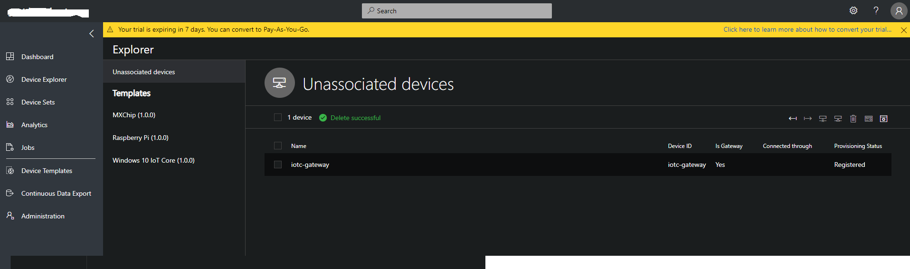
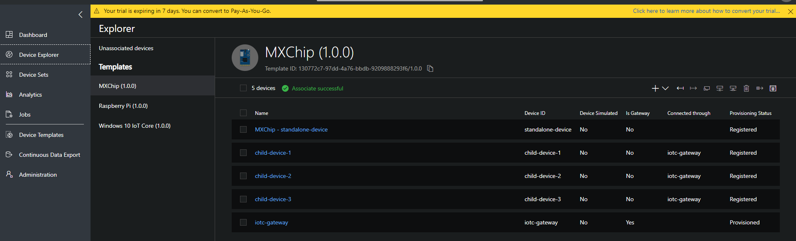
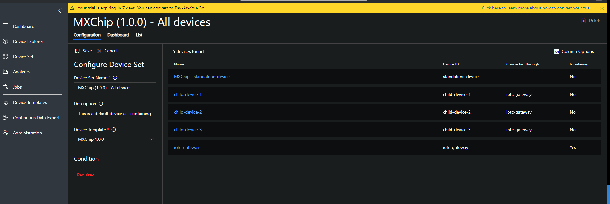
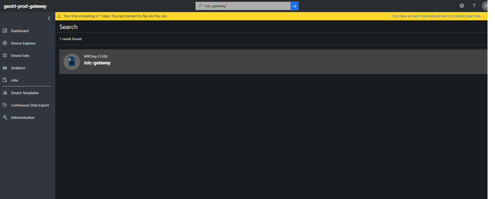
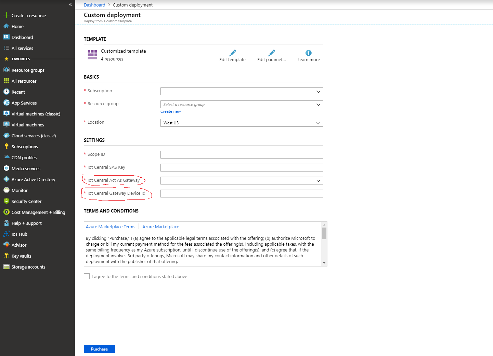

# Additional fork changes for Rigado onboarding

## Overall

- Removed the need for the `IoT Central Act As Gateway` field, as this will always be true
- Removed the hard-coding for `IoT Central Gateway Device Id`, instead the `gatewayId` that is sent in the `device` object will be used. This allows the IoT Central app to be able to:
  - be flexible on what gateways it listens to
  - listen to multiple gateways at once

## [lib/engine.js changes](IoTCIntegration\lib\engine.js)

- Booleans are not supported by Azure IoT Central, so they are converted to their integer equivalents
  
```js
/**
 * Converts all the boolean measurements into integers
 */
function convertMeasurements(measurements) {
  for (const field in measurements) {
    if (typeof measurements[field] == 'boolean') {
        measurements[field] = measurements[field] ? 1 : 0;
    }
  }
}
```

- Encapsulated `deviceId` validation
  
```js
/**
 * @returns true if deviceId conforms to Azure requirements
 */
function validateDeviceId(deviceId) {
    return deviceId && /^[a-z0-9\-]+$/.test(deviceId);
}
```

More info about Rigado [here](https://catalog.azureiotsolutions.com/details?title=Cascade_500-IoT-Gateway&source=all-devices-page).

# Fork changes for Azure IoT Central Device Bridge to represent bridge as a gateway device within Azure IoT Central

The current fork has changes to enable Azure IoT Central Device Bridge to be represented in IoT Cental as a gateway.

To use the device bridge solution, you will need the following:

- an Azure account. You can create a free Azure account from [here](https://aka.ms/aft-iot)
- an Azure IoT Central application to connect the devices. Create a free app by following [these instructions](https://docs.microsoft.com/en-us/azure/iot-central/quick-deploy-iot-central)

[](https://portal.azure.com/#create/Microsoft.Template/uri/https%3A%2F%2Fraw.githubusercontent.com%2Fkwang21093%2Fiotc-device-bridge%2Fmaster%2Fazuredeploy.json)

## New Azure Iot Central features to display generic, transparent gateway devices  

With the latest changes in Azure IoT Central, users are able to see the parent-child relationship between the generic gateway device and child devices connected through a given gateway.

During device registration, the device can register itself to have the following characteristics:

- Regular device connected directly to IoT Central
- Generic gateway device
- Device connected to IoT Central through the generic gateway. The device indicates its parent gateway device ID through which it is connected to

### Displaying device gateway information within Device Explorer and Device Sets

In order to view the gateway connection attributes within the Device Explorer or Device Sets pages, you can click "Column Options" to add the "Device Type" and "Connected to" column options.

Unassosiated gateway device
  

Unassociated Device connected to gateway


Associated devices view


Configure Device Set to display gateway related columns



### Search to display all devices connected to a given gateway

Full text search has been extended to search within deviceGatewayId represented as "Connected to" column in the Device Explorer.
You can see all child devices connected to a given gateway by entering gateway device ID within search input.



An optional `timestamp` field can be included in the body, to specify the UTC date and time of the message.
This field must be in ISO format (e.g., YYYY-MM-DDTHH:mm:ss.sssZ). If `timestamp` is not provided,
the current date and time will be used.

> NOTE: `deviceId` must be alphanumeric, lowercase, and may contain hyphens. The values of the fields in `measurements` must be numbers or strings.

1. When a message with a new `deviceId` is sent to IoT Central by the device bridge, a device will be created as an **Unassociated device**. Unassociated devices appear in your IoT Central application in `Device Explorer > Unassociated devices`. Click `Associate` and choose a device template to start receiving incoming measurements from that device in IoT Central.

> NOTE: Until the device is associated to a template, HTTP calls to the function will return a 403 error status.


## What is being provisioned? (pricing)

The custom template in this repository will provision the following Azure resources:

- Key Vault, needed to store your IoT Central key
- Storage Account
- Function App
- Consumption Plan

The Function App runs on a [consumption plan](https://azure.microsoft.com/en-us/pricing/details/functions/).
While this option does not offer dedicated compute resources, it allows device bridge to handle
**hundreds of device messages per minute**, suitable for smaller fleets of devices or devices that send messages less frequently.
If your application depends on streaming a large number of device messages, you may choose to replace the
consumption plan by dedicated a [App Service Plan](https://azure.microsoft.com/en-us/pricing/details/app-service/windows/).
This plan offers dedicated compute resources, which leads to faster server response times.
Using a standard App Service Plan, the maximum observed performance of the Azure Function in this repository was around
**1,500 device messages per minute**. You can learn more about the [Azure Function hosting options
in documentation](https://docs.microsoft.com/en-us/azure/azure-functions/functions-scale).

## Changes to the fork

See original documentation in Read.me of upstream branch for complete deployment instructions.

[azuredeploy.json](azuredeploy.json) has been modified to include 2 new parameters:

```json
"iotCentralActAsGateway": {
    "type": "bool"
},
"iotCentralGatewayDeviceId": {
    "type": "String"
}
```

Act as Gateway is a boolean flag indicating if device bridge should register itself as a gateway within IotCentral. Set this flag to true otherwise solution will work as upstream branch.

 Gateway Device ID is a device ID which will represent the bridge as a gateway device within Azure IoT Central.

 

## [lib/engine.js changes](IoTCIntegration\lib\engine.js)

A code block has been introduced to register the bridge as a gateway when the Azure Function receives it's first request. Please take note that none of subsequent requests will be proccessed until the bridge is assocciated with a Device Template in your IoT Central application.

```js
if (context.actAsGateway) {
        if (!gatewayDevice) {
            gatewayDevice = { deviceId: context.gatewayDeviceId };
        }

        const gatewayClient = Device.Client.fromConnectionString(await getDeviceConnectionString(context, gatewayDevice), DeviceTransport.Http);
        try {
            await util.promisify(gatewayClient.open.bind(gatewayClient))();
            context.log('[HTTP] Sending telemetry for gateway device', gatewayDevice.deviceId);
            // TODO: add any gateway specific telemetry if needed
            // await util.promisify(gatewayClient.sendEvent.bind(gatewayClient))(new Device.Message(JSON.stringify({["ping"]:1})));
            await util.promisify(gatewayClient.close.bind(gatewayClient))();

        } catch (e) {
            // If the device was deleted, we remove its cached connection string
            if (e.name === 'DeviceNotFoundError' && deviceCache[gatewayDevice.deviceId]) {
                delete deviceCache[gatewayDevice.deviceId].connectionString;
            }
            throw new Error(`Unable to send telemetry for gateway device ${gatewayDevice.deviceId}: ${e.message}`);
        }

        device.gatewayId = gatewayDevice.deviceId;
    }
```
  
Device Provisioning Service api call has been changed to add ab extra post body information to indicate if the device is a gateway device or a child device connected to the gateway.

```js
const bodyJson = {
        registrationId: deviceId
    };

    if (context.actAsGateway) {
        if (device.gatewayId) {
            bodyJson["data"] = {
                iotcGateway: {
                    iotcGatewayId: device.gatewayId,
                    iotcIsGateway: false
                }
            }
        } else {
            bodyJson["data"] = {
                iotcGateway: {
                    iotcGatewayId: null,
                    iotcIsGateway: true
                }
            }
        }
    }

    const registrationOptions = {
        url: `https://${registrationHost}/${context.idScope}/registrations/${deviceId}/register?api-version=${registrationApiVersion}`,
        method: 'PUT',
        json: true,
        headers: { Authorization: sasToken },
        body: bodyJson,
    };
}
```

## Limitations

This device bridge only forwards messages to IoT Central, and does not send messages back to devices. Due to the unidirectional nature of this solution, `settings` and `commands` will **not** work for devices that connect to IoT Central through this device bridge. Because device twin operations are also not supported, it's **not** possible to update `device properties` through this setup. To use these features, a device must be connected directly to IoT Central using one of the [Azure IoT device SDKs](https://docs.microsoft.com/en-us/azure/iot-hub/iot-hub-devguide-sdks).
